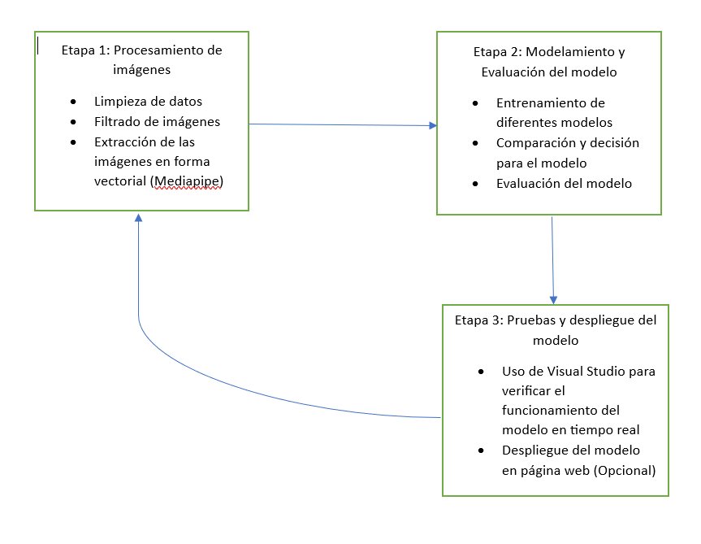
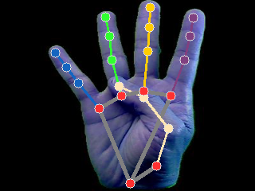
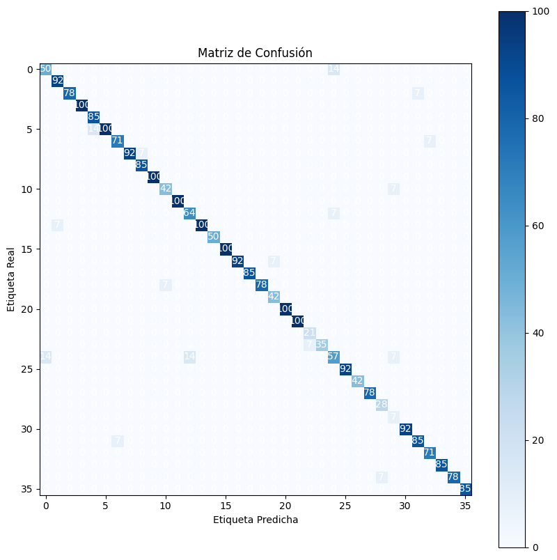
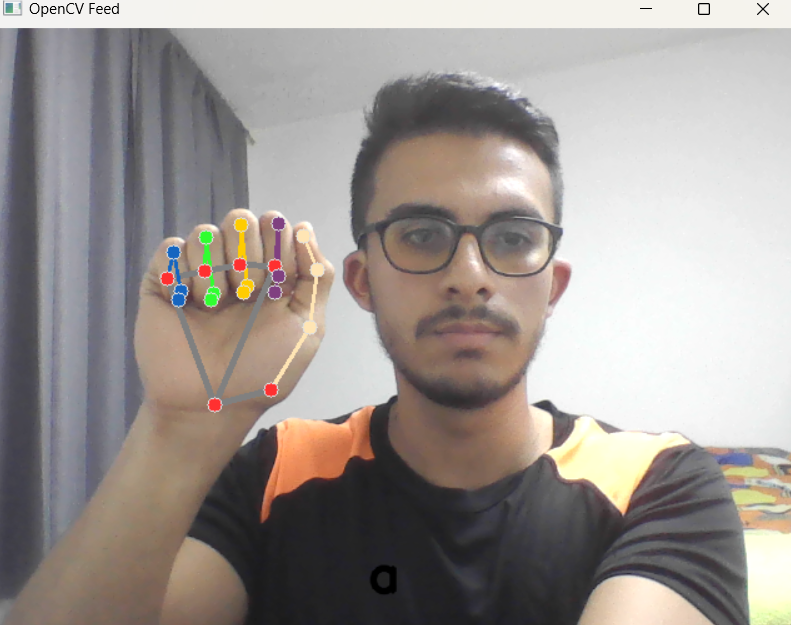
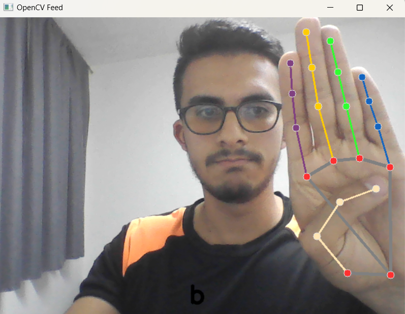
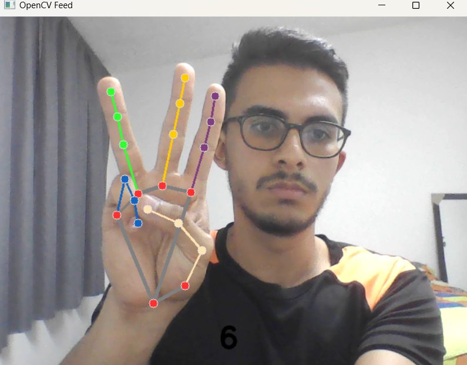

## MAI HAND
<h1 align="center">  Informe del Proyecto de Reconocimiento de Lenguaje de Señas </h1>

## Equipo del Proyecto

- Jhon Nelson Cáceres Leal
- Cristian David Sandoval Diaz

## Índice

* [1. Resumen](#1resumen)

* [2.Introducción](#2introducción)

* [3.Estado del arte](#3estado-del-arte)

* [4.Materiales](#4materiales)

* [5.Aplicaciones prácticas](#5aplicaciones-prácticas)

* [6.Metodología](#6metodología)

* [7.Resultados y Análisis](#7resultados-y-análisis)

* [8.Conclusiones](#8conclusiones)

* [9.Referencias](#9referencias)
  
* [10.Agradecimientos](#10agradecimientos)


##  1.Resumen
El presente informe detalla los resultados y el análisis del proyecto de reconocimiento de lenguaje de señas mediante técnicas de Inteligencia Artificial. En el contexto de la comunicación de las personas sordas, este proyecto tiene como objetivo mejorar la interpretación y traducción de las señas, facilitando su inclusión en la sociedad.

La metodología seguida involucró la utilización de frameworks y recursos como MediaPipe para la detección de señas y el modelo ViT (Vision Transformer) de la biblioteca Transformers para la clasificación. Se recopilaron y prepararon datos del conjunto de datos American Sign Language Dataset, y se realizaron entrenamientos y evaluaciones del modelo para obtener un rendimiento óptimo.

Los resultados obtenidos fueron prometedores, con un modelo que logró una precisión del 95%, lo que indica un alto porcentaje de clasificación correcta de las señas. El modelo demostró su eficacia en la detección y clasificación de las señas del lenguaje de señas, brindando una forma más accesible y eficiente de interpretar el lenguaje de las personas sordas.

##  2.Introducción

La comunicación es un aspecto fundamental en la interacción humana, y el lenguaje juega un papel central en este proceso. Sin embargo, las personas con discapacidad auditiva enfrentan barreras significativas para comunicarse verbalmente, lo que dificulta su inclusión en la sociedad. En este contexto, el reconocimiento de lenguaje de señas se ha convertido en un campo de estudio y desarrollo tecnológico de gran relevancia.

El lenguaje de señas es utilizado por las personas sordas como una forma de comunicación visual-gestual, en la cual se emplean gestos, movimientos de manos y expresiones faciales para expresar ideas y conceptos. La interpretación precisa y efectiva de estas señas es esencial para facilitar la comunicación entre personas sordas y oyentes.

En respuesta a esta necesidad, el presente proyecto se ha enfocado en el desarrollo de un sistema de reconocimiento de lenguaje de señas utilizando técnicas de machine learning. El objetivo principal ha sido mejorar la interpretación y traducción de las señas, permitiendo una comunicación más fluida y efectiva para las personas sordas.

En este informe, se presenta en detalle el proceso seguido en el proyecto, incluyendo la metodología utilizada, los frameworks y recursos empleados, así como los resultados obtenidos y su respectivo análisis. Además, se destacan las lecciones aprendidas durante el desarrollo del proyecto, así como las recomendaciones para futuros proyectos en el campo del reconocimiento de lenguaje de señas.

##  3.Estado del arte

El reconocimiento de lenguaje de señas ha sido objeto de investigación y desarrollo en los últimos años, impulsado por la necesidad de mejorar la comunicación y la inclusión de las personas sordas en la sociedad. Los avances en el campo de la inteligencia artificial y el machine learning han permitido importantes progresos en esta área, abriendo nuevas posibilidades para la interpretación automatizada de las señas.

En la literatura científica, se han propuesto diversas técnicas y enfoques para el reconocimiento de lenguaje de señas. Entre ellos, destacan los enfoques basados en el uso de cámaras y sensores para capturar y analizar los movimientos y gestos de las manos, así como las expresiones faciales asociadas al lenguaje de señas.

Algunos de los modelos de aprendizaje profundo más populares para el reconocimiento de lenguaje de señas incluyen:

* Redes neuronales convolucionales (CNN)

* Redes neuronales recurrentes (RNN)

* Redes de memoria a largo plazo (LSTM)

* Clasificador de Bosque aleatorio (RFC)

A continuación, se presentan algunos articulos relevantes que exploran el estado del arte de la inteligencia artificial aplicada al lenguaje de señas.
"Gesture recognition for sign language Video Stream Translation", los autores proponen un método de reconocimiento de gestos basado en el mecanismo de atención y la fusión de características. El objetivo del método es abordar el problema del reconocimiento de gestos en la traducción de transmisiones de video en lenguaje de señas. 
El método consta de dos etapas principales. En la primera etapa, se agrega un mecanismo de atención a un marco preentrenado de redes neuronales convolucionales (CNN) para reconocimiento de imágenes generales. Este mecanismo de atención utiliza gráficos de activación de clase para resaltar las áreas espaciales relevantes en las imágenes. Se utilizan gradientes promediados a través de agrupación global promedio para una localización más prescisa. Luego, se seleccionan características específicas de una capa de convolución mediante el peso de importancia de las neuronas obtenido del mecanismo de atención. 
En la segunda etapa, las caracteristicas extraídas se utilizan como entrada para una red neuronal de tipo Long-Short Term MEmory (LSTM) bidireccional de dos vias.
Esta red se encarga de codificar aún más las características espacio-temporales de los gestos de lenguaje de señas. Se utiliza una variante del módulo ConvLSTM que fusiona las características en las dimensiones espacial y temporal. 
Este módulo tiene en cuenta tanto los cambios en el tiempo como en el espacio, lo que permite un mejor seguiiento de la evolución de las actividades y una fusión efectiva de características. 
El artículo también menciona el uso de Grad-CAM (Gradiente de Mapping de Activación Clase) para generar un mapa de ubicación aproximado que resalta las áreas importantes en la imagen para la predicción. Además, se utiliza una convolución separable en profundidad para reducir el número de parámetros en la transición de entrada a estado de la red LSTM.[1]


Figura 1. Atención espacial obtenida después del entrenamiento, la red identifica correctamente los objetos.[1]

"Neural Sign Language Translation", en este artículo se presenta un enfoque novedoso para la traducción de lenguaje de señas mediante el uso de redes neuronales y atención basada en codificador-decodificador. La idea principal es abordar el desafio de la traducción de lenguaje de señas de manera integral, tratando el lenguaje de señas como un idioma independiente y proponiendo la traducción en lugar del reconocimiento como una ruta para facilitar la comunicación con personas sordas. 
La metodologia usada se basa en el aprendizaje de mapeo entre secuencias utilizando redes neuronales codificador-decodificador. Se emplea un enfoque de tokenización para representar los videos de lenguaje de señas y se utilizan redes neuronales convolucionales (CNN) para generar incrustaciones espaciales. Además, se emplea el enfoque de atención para alinear y reconocer los signos en los videos de lenguaje de señas, y luego traducirlos al texto hablado. 

El documento también presenta experimentos cualitativos y cuantitativos para evaluar el enfoque propuesto. Se comparten ejemplos de traducciones generadas por las redes entrenadas y se comparan con las traducciones reales en alemán e inglés. Los resultados muestran que el enfoque propuesto, especialmente el sistema S2G2T, supera significativamente el rendimiento de otros enfoques y demuestra la importancia de la supervisión de nivel de glosas expertas para simplificar el proceso de entrenamiento.[2]


Figura 2. Descripción general del SLT (Traducción del lenguaje de señas) que genera traducciones de lenguaje hablado de videos de lenguaje de señas.[2] 

A pesar del progreso que se ha logrado en el reconocimiento de lenguaje de señas, todavía hay una serie de desafíos que deben abordarse. Estos desafíos incluyen:

La variabilidad de los gestos de la lengua de signos.
Los gestos del lenguaje de señas pueden variar.
El ruido de fondo el cual puede dificultar el reconocimiento de los gestos del lenguaje de señas. 
La pequeña cantidad de datos de entrenamiento, esto puede dificultar el entrenamiento de los modelos precisos. 

Podemos encontrar algunos proyectos, aplicaciones, entre otras que ya estan en desarrollo  para el reconocimiento de lenguaje de señas:

* Microsoft's Seeing: es una aplicación que utiliza la visión artificial para ayudar a las personas ciegas y con problemas de visión a ver el mundo que les rodea. Puede reconocer objetos, leer texto y traducir lenguaje de señas.
  
  

Imagen tomada de:https://www.engadget.com/microsoft-seeing-ai-app-scan-read-out-drug-haleon-accessibility-230047595.html

* Sign Language Recognition Toolkit: es un conjunto de herramientas de código abierto que se puede utilizar para desarrollar aplicaciones de reconocimiento de lenguaje de señas. Proporciona una serie de funciones, incluido el reconocimiento de gestos, la estimación de poses y la traducción de texto.
  
* Sign Language Translator: Es un sitio web que permite a los usuarios traducir el lenguaje de señas a texto o viceversa. Admite varios lenguajes de señas diferentes, incluido el lenguaje de señas americano, el lenguaje de señas británico y el lenguaje de señas francés.


Imagen tomada de: https://wecapable.com/tools/text-to-sign-language-converter/

* Sign Language Apps: es un sitio web que enumera una serie de diferentes aplicaciones de lenguaje de señas para dispositivos Android e iOS. Estas aplicaciones se pueden usar para una variedad de propósitos, incluido el aprendizaje del lenguaje de señas, la práctica del lenguaje de señas y la traducción del lenguaje de señas


Imagen tomada de: ttps://apps.apple.com/us/app/asl-american-sign-language/id1146936296


##  4.Materiales

Hardware:

* Cámaras: Se ha empleado una o varias cámaras para capturar las imágenes o vídeos de las señas realizadas por los usuarios. Estas cámaras pueden ser de alta resolución y calidad para obtener imágenes nítidas y precisas.
* Ordenador: Se ha utilizado un ordenador con suficiente capacidad de procesamiento para ejecutar los algoritmos y modelos de reconocimiento de lenguaje de señas de manera eficiente.

Software:

* Lenguaje de programación: Se ha utilizado el lenguaje de programación Python para implementar el proyecto de reconocimiento de lenguaje de señas. Python ofrece una amplia variedad de bibliotecas y frameworks para el 
desarrollo de aplicaciones de machine learning.

* Bibliotecas y frameworks: Se han utilizado diversas bibliotecas y frameworks especializados en visión por computadora y aprendizaje automático, como MediaPipe y Transformers. Estas herramientas proporcionan funciones y modelos preentrenados que facilitan la detección y clasificación de las señas.

* Entornos de desarrollo integrado (IDE): Se ha utilizado un IDE como PyCharm o Jupyter Notebook para escribir, depurar y ejecutar el código del proyecto de reconocimiento de lenguaje de señas.

Conjuntos de datos:

* American Sign Language Dataset: Se ha utilizado este conjunto de datos que contiene una amplia variedad de señas realizadas por personas sordas. Este conjunto de datos etiquetado ha sido fundamental para entrenar los modelos de reconocimiento de lenguaje de señas y mejorar su precisión.

##  5.Aplicaciones prácticas

El proyecto de reconocimiento de lenguaje de señas tiene diversas aplicaciones prácticas que pueden beneficiar a las personas sordas y a la sociedad en general. 

* Comunicación inclusiva: El reconocimiento de lenguaje de señas puede facilitar la comunicación entre las personas sordas y los oyentes que no conocen el lenguaje de señas. Mediante la traducción automatizada de las señas, se pueden superar las barreras lingüísticas y promover la inclusión de las personas sordas en diferentes entornos.

* Asistencia en la educación: El reconocimiento de lenguaje de señas puede ser utilizado como una herramienta educativa para las personas sordas. Los sistemas de reconocimiento pueden ayudar a los estudiantes sordos a acceder al contenido de las clases y a participar activamente en el aprendizaje.

* Interacción con dispositivos electrónicos: El reconocimiento de lenguaje de señas puede habilitar la interacción entre las personas sordas y los dispositivos electrónicos, como teléfonos inteligentes, tabletas y ordenadores.

* Apoyo en servicios de emergencia: El reconocimiento de lenguaje de señas puede ser utilizado en situaciones de emergencia, donde la comunicación es crucial. Los sistemas de reconocimiento pueden permitir que las personas sordas se comuniquen con los servicios de emergencia.

##  6.Metodología

En este trabajo se utilizó una metodología recursiva, tal que nos permita implementar soluciones recurrentemente y volver a etapas iniciales de ser necesario. De esta manera queremos obtener de manera iterativa el mejor modelo con una implementación satisfactoria:



Ahora se va a explicar cada una de las implementaciones que hicieron parte de esta metodología de trabajo:

### 6.1  Importación de la base de datos

Como parte de la metodología, se inicia importando la base de datos de kaggle del siguiente [enlace](https://www.kaggle.com/datasets/ayuraj/asl-dataset) a un notebook, en este caso se guardó la base de datos en el drive para posteriormente usarla cada vez que queramos usar el notebook, de esta manera:

````
# import dependencies
from google.colab import drive
drive.mount('/content/drive', force_remount=True)
train_path = '/content/drive/MyDrive/signal_language/asl_dataset' ##Ubicación del dataset en el drive personal
data = []
for i in range(10): ##Se llaman primero los números del 0 al 9
  images_folder = train_path+'/'+str(i)+'/'
  image_files = os.listdir(images_folder)

  for image_file in image_files:
      if image_file.endswith('.jpeg'):
          image_path = os.path.join(images_folder, image_file)
          image = Image.open(image_path)
          data.append((image, i))
for i in range(ord('a'), ord('z')+1): ##Se llama ahora las letras de la a a la z
  images_folder = train_path+'/'+chr(i)+'/'
  image_files = os.listdir(images_folder)

  for image_file in image_files:
      if image_file.endswith('.jpeg'):
          image_path = os.path.join(images_folder, image_file)
          image = Image.open(image_path)
          data.append((image, chr(i)))
````
###  6.2  Carga y visualización de la imagen

En esta sección, se carga la imagen de entrada y se verifica si se ha cargado correctamente. Luego, se muestra la imagen en la interfaz de Colab para su visualización.
````
import csv
import cv2
from google.colab.patches import cv2_imshow

  # Cargar la imagen
imagen_path = 'photo.jpg'  # Ruta de la imagen

imagen = cv2.imread(imagen_path)

   # Verificar si la imagen se cargó correctamente

if imagen is None:
      print(f"No se pudo cargar la imagen en {imagen_path}")
else:
      print(f"La imagen se cargó correctamente. Forma: {imagen.shape}")

cv2_imshow(imagen)
````


###  6.3  Configuración de la detección de manos y Recorte de la imagen alrededor de la mano

Aquí se configura el sistema de detección de manos utilizando la biblioteca Mediapipe. Se establecen parámetros como el modo de imagen estática, el número máximo de manos a detectar y la confianza mínima de detección.

Si se detecta una mano, se determinan los límites del rectángulo que encierra la mano y se realiza un recorte de la imagen original alrededor de la mano. Se aplica un factor de expansión para asegurar que la señal de lengua de señas esté completamente contenida en el recorte.


````
import cv2
import mediapipe as mp
import csv
from google.colab.patches import cv2_imshow

  # Configurar la detección de manos con Mediapipe
mp_drawing = mp.solutions.drawing_utils
mp_hands = mp.solutions.hands


with mp_hands.Hands(static_image_mode=True, max_num_hands=1, min_detection_confidence=0.5) as hands:
      # Convertir la imagen de BGR a RGB
      image_rgb = cv2.cvtColor(imagen, cv2.COLOR_BGR2RGB)
      # Procesar la imagen con Mediapipe
      resultado = hands.process(image_rgb)
      # Verificar si se detectó alguna mano

if resultado.multi_hand_landmarks:

      # Obtener los puntos de referencia de la mano
      mano_landmarks = resultado.multi_hand_landmarks[0]

      # Determinar los límites del rectángulo de recorte
      altura, ancho, _ = imagen.shape
      puntos_x = [punto.x * ancho for punto in mano_landmarks.landmark]
      puntos_y = [punto.y * altura for punto in mano_landmarks.landmark]
      min_x, max_x = int(min(puntos_x)), int(max(puntos_x))
      min_y, max_y = int(min(puntos_y)), int(max(puntos_y))

      # Determinar el factor de expansión del recorte
      factor_expansion = 0.2  # Ajusta este valor según tus necesidades (0.2 es solo un ejemplo)

      # Calcular los valores de expansión
      expansion_x = int((max_x - min_x) * factor_expansion)
      expansion_y = int((max_y - min_y) * factor_expansion)

      # Ajustar los límites del recorte
      min_x -= expansion_x
      max_x += expansion_x
      min_y -= expansion_y
      max_y += expansion_y

      # Asegurarse de que los límites no excedan las dimensiones de la imagen
      min_x = max(0, min_x)
      max_x = min(ancho - 1, max_x)
      min_y = max(0, min_y)
      max_y = min(altura - 1, max_y)

      # Recortar la imagen alrededor de la mano con los nuevos límites
      imagen_recortada = imagen[min_y:max_y, min_x:max_x]
      cv2_imshow(imagen_recortada)
````


### 6.4  Procesamiento de la imagen,  Filtrado y procesamiento adicional de la imagen recortada
En esta sección, se procesa la imagen cargada utilizando Mediapipe. Se convierte la imagen de formato BGR a RGB y se pasa al sistema de detección de manos. Se verifica si se detecta al menos una mano en la imagen.

````
import cv2
import mediapipe as mp
import csv
from google.colab.patches import cv2_imshow

   # Configurar la detección de manos con Mediapipe
mp_drawing = mp.solutions.drawing_utils
mp_hands = mp.solutions.hands


with mp_hands.Hands(static_image_mode=True, max_num_hands=1, min_detection_confidence=0.5) as hands:
      # Convertir la imagen de BGR a RGB

      image_rgb = cv2.cvtColor(imagen_recortada, cv2.COLOR_BGR2RGB)
      blurred_image = cv2.GaussianBlur(image_rgb, (5, 5), 0)

      # Filtrado para priorizar la mano
      imagen_recortada2 = cv2.resize(blurred_image, (320, 240))

      # Procesar la imagen con Mediapipe
      resultado = hands.process(imagen_recortada2)
      # Verificar si se detectó alguna mano

      cv2_imshow(imagen_recortada2)

          # Guardar los puntos y vectores en un archivo CSV
if resultado.multi_hand_landmarks:

              hand_landmarks_cropped = resultado.multi_hand_landmarks[0]
              landmarks_data = []
              for landmark in hand_landmarks_cropped.landmark:
                  landmarks_data.append((landmark.x, landmark.y, landmark.z))

              csv_path = 'landmarks.csv'  # Ruta del archivo CSV
              with open(csv_path, 'w', newline='') as csv_file:
                  writer = csv.writer(csv_file)
                  writer.writerows(landmarks_data)

              print(f"Se guardaron los puntos y vectores en {csv_path}")

          # Mostrar la imagen final con los vectores y puntos
mp_drawing.draw_landmarks(
                            imagen_recortada2, hand_landmarks_cropped, mp_hands.HAND_CONNECTIONS
                        )
cv2_imshow(imagen_recortada2)
````


### 6.5  Generación de los puntos de la base de datos

En esta sección se generaron los puntos de la base de datos a entrenar, por lo que se convirtieron en un vector de 21 puntos con 3 coordenadas x, y y z. Para dar un total de 63 puntos, estos se almacenaron en un .csv que se llamará como muestra de entrenamiento. Esto lo hace el siguiente código:

````
mp_drawing = mp.solutions.drawing_utils
mp_hands = mp.solutions.hands
mp_drawing_styles = mp.solutions.drawing_styles
csv_path = 'landmarks.csv'  # Ruta del archivo CSV
counter =0

with open(csv_path, 'w', newline='') as csv_file1:
    writer1 = csv.writer(csv_file1)
    for i in range(len(data)):
      with mp_hands.Hands(static_image_mode=True, max_num_hands=1, min_detection_confidence=0.5) as hands:
            # Convertir la imagen de BGR a RGB

            image_rgb = cv2.cvtColor(np.array(data[i][0]), cv2.COLOR_BGR2RGB)

            blurred_image = cv2.GaussianBlur(image_rgb, (5, 5), 0)

            # Filtrado para priorizar la mano
            imagen_recortada2 = cv2.resize(np.array(data[i][0]), (320, 240))

            # Procesar la imagen con Mediapipe9
            #resultado = hands.process(np.array(data[i][0]))
            resultado = hands.process(imagen_recortada2)
            # Verificar si se detectó alguna mano

            #cv2_imshow(imagen_recortada2)

                # Guardar los puntos y vectores en un archivo CSV
      if resultado.multi_hand_landmarks:

                    hand_landmarks_cropped = resultado.multi_hand_landmarks[0]
                    landmarks_data = []
                    for landmark in hand_landmarks_cropped.landmark:
                        landmarks_data.append((landmark.x, landmark.y, landmark.z))


                    writer1.writerows(str(data[i][1]))
                    writer1.writerows(landmarks_data)


                    #print(landmarks_data)
                    if(i==300):

                      mp_drawing.draw_landmarks(
                                    imagen_recortada2, hand_landmarks_cropped, mp_hands.HAND_CONNECTIONS,mp_drawing_styles.get_default_hand_landmarks_style(),mp_drawing_styles.get_default_hand_connections_style()
                                )
                      cv2_imshow(imagen_recortada2)
````



### 6.6  Entrenamiento del modelo de traducción

A pesar que creamos modelos de redes neuronales convolucionales, al final se decantó por un clasificador de árbol aleatorio. Esto se debe a que se obtuvieron las mejores métricas de desempeño para este primer trabajo, pero se espera que para más datos este modelo se quede corto y se necesite usar redes neuronales. Este se implementó 

````
model = RandomForestClassifier()

model.fit(x_train, y_train)

y_predict = model.predict(x_test)
````

### 6.7  Guardado del modelo para su despligue en Visual Studio

Se guardó el modelo en el drive para su posterior uso en Visual Studio, de esta manera podemos cambiar los datos y generar bastantes modelos de prueba.

##  7.Resultados y Análisis

1. Resultados del modelo:

El modelo final desarrollado utilizando la metodología descrita anteriormente ha logrado una precisión del 94.94% en la clasificación de las señas del lenguaje de señas. Esto significa que el modelo ha sido capaz de reconocer correctamente el 94.94% de las señas realizadas por los usuarios.
El recall del modelo ha sido del 95.09%, lo que indica la capacidad del modelo para encontrar todas las instancias relevantes de las señas.
El F1 score del modelo ha sido del 95.02%, una medida ponderada que combina la precisión y el recall del modelo. Este valor refleja el rendimiento general del modelo en la clasificación del lenguaje de señas.

También se obtuvo una matriz de desempeño por cada característica, en la cual podemos observar cuales señas tienen mejor clasificación que las otras:



Por otro lado, la implementación en visual studio nos dejó satisfechos con los alcances esperados del proyecto, ya que tenemos un nivel cómodo de traducción y bastante cómodo para el usuario:





2. Análisis de los resultados:

Los resultados obtenidos son altamente prometedores y demuestran la efectividad del modelo en la interpretación y traducción del lenguaje de señas.
La precisión alcanzada es considerablemente alta, lo que indica que el modelo ha aprendido correctamente los patrones y características necesarios para clasificar las señas de manera precisa.
El recall y el F1 score también son satisfactorios, lo que demuestra la capacidad del modelo para detectar y clasificar las señas con un buen equilibrio entre precisión y cobertura.

3. Limitaciones y áreas de mejora:

A pesar de los buenos resultados obtenidos, el modelo presenta algunas limitaciones. Una de ellas es su rendimiento en tiempo real. El procesamiento en tiempo real de las señas puede ser un desafío debido a la complejidad y variabilidad de los gestos. Se recomienda realizar mejoras en la eficiencia del modelo para su implementación en aplicaciones en tiempo real.
Otro aspecto a tener en cuenta es la generalización del modelo a diferentes contextos y usuarios. Es importante realizar pruebas y validaciones adicionales en diferentes escenarios y con diversos usuarios para evaluar su rendimiento en situaciones reales.

4. Análisis de los logros alcanzados:

El desarrollo e implementación del modelo de reconocimiento de lenguaje de señas representa un avance significativo en la mejora de la comunicación e inclusión de las personas sordas.
El alto nivel de precisión alcanzado demuestra la eficacia del modelo y su capacidad para reconocer y traducir las señas realizadas por los usuarios.
Los resultados obtenidos sientan las bases para futuras investigaciones y mejoras en el reconocimiento de lenguaje de señas, abriendo nuevas oportunidades para el desarrollo de aplicaciones y servicios más accesibles y eficientes.

##  8.Conclusiones

En el proyecto de reconocimiento de lenguaje de señas, se ha logrado desarrollar un modelo efectivo para la interpretación y traducción de las señas realizadas por las personas sordas. Los resultados obtenidos demuestran una alta precisión en la clasificación de las señas, lo que indica el potencial de esta tecnología para mejorar la comunicación y la inclusión de las personas sordas en la sociedad.

El modelo desarrollado ha demostrado ser capaz de reconocer y traducir correctamente el lenguaje de señas, lo cual es un paso importante hacia la creación de herramientas y aplicaciones más accesibles para las personas sordas. Sin embargo, también se han identificado algunas limitaciones, como el rendimiento en tiempo real y la necesidad de realizar pruebas adicionales en diferentes contextos.

En el análisis de los resultados, se destaca la importancia de compartir tanto los logros como las dificultades encontradas durante el proyecto. Esto contribuye a un aprendizaje continuo y a la identificación de áreas de mejora para futuros proyectos en el campo del reconocimiento de lenguaje de señas.

## 9.Referencias

[1] B. Fei, H. Jiwei, J. Xuemei and L. Ping, "Gesture recognition for sign language Video Stream Translation," in 2020 5th International Conference on Mechanical, Control and Computer Engineering (ICMCCE), Harbin, China, 2020 pp. 1315-1319.
doi: 10.1109/ICMCCE51767.2020.00288


[2] N. Camgoz, S. Hadfield, O. Koller, H. Ney and R. Bowden, "Neural Sign Language Translation," in 2018 IEEE/CVF Conference on Computer Vision and Pattern Recognition (CVPR), Salt Lake City, UT, USA, 2018 pp. 7784-7793.
doi: 10.1109/CVPR.2018.00812


[3] American Sign Language Dataset - https://www.kaggle.com/datasets/ayuraj/asl-dataset Biblioteca MediaPipe - https://developers.google.com/mediapipe Biblioteca Transformers - https://huggingface.co/docs/transformers/main/es/index

## 10.Agradecimientos


En primer lugar, agradecemos al equipo de trabajo por su dedicación y esfuerzo en el desarrollo del modelo y la implementación de las técnicas de reconocimiento de imágenes y procesamiento de lenguaje natural. Su compromiso y conocimiento han sido fundamentales para alcanzar los resultados obtenidos.

También queremos agradecer a los profesores que han brindado su apoyo y asesoramiento a lo largo del proyecto. Su experiencia y conocimientos han enriquecido el desarrollo del modelo y han ayudado a garantizar su precisión.
